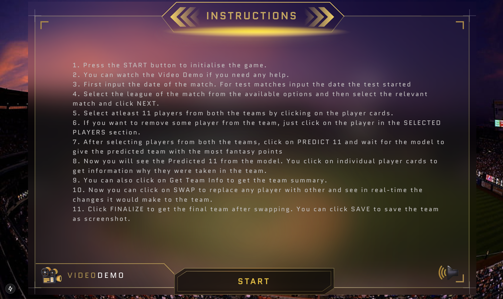
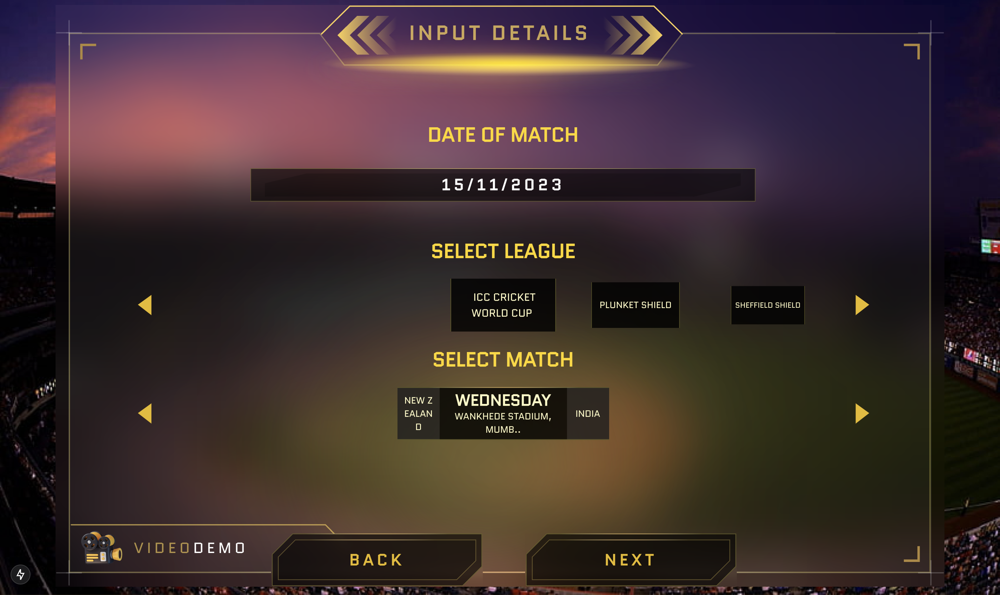
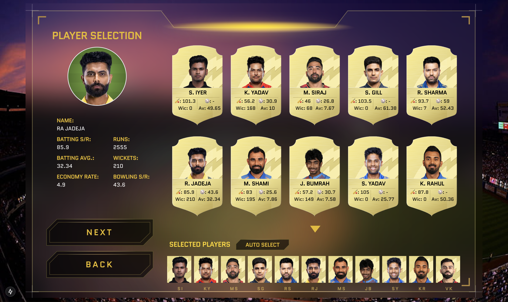
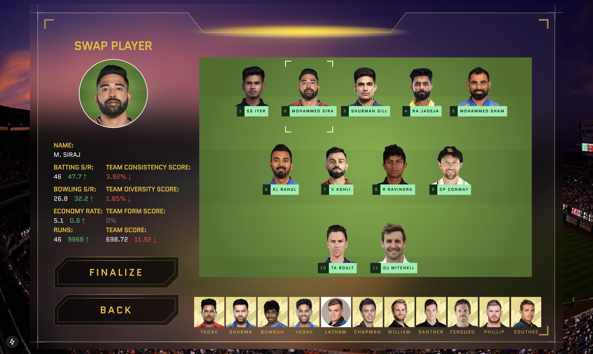
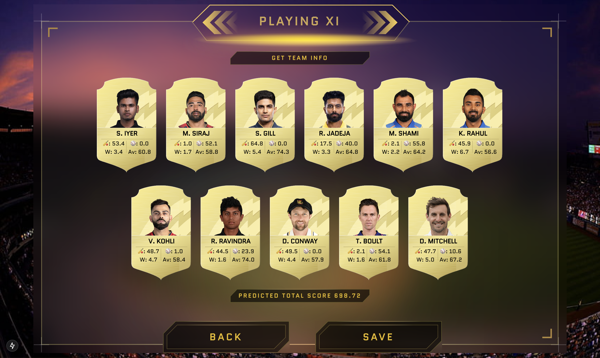

# Product UI

## Overview

The Product UI for the Dream11 Team Prediction Game provides an intuitive and engaging platform for users to create and manage their fantasy teams. It bridges the gap between the backend AI models and users, showcasing predictions and player insights in a visually appealing manner.

With features like real-time statistics and a user-friendly interface, the UI enhances the traditional fantasy gaming experience. Designed to be responsive and efficient, it caters to both casual users and competitive fantasy enthusiasts, ensuring an enjoyable and seamless gameplay experience.

## Contents

- [Features](#features)
- [Folder Structure](#folder-structure)
- [Technologies Used](#technologies-used)
- [Dependencies](#dependencies)
- [Setup](#how-to-setup)

## Features

- **Team Creation Interface**: Allows users to select players and create fantasy teams.
- **Prediction Visualization**: Displays predictive insights to assist users in building better teams.
- **User-Friendly Design**: Responsive and intuitive design tailored for a seamless gaming experience.
- **Interactive Dashboard**: View team performance and player statistics.

## Folder Structure

```plaintext
UI/
├── app/           # Contains the core application structure
│   ├── api/  # API requests for different functions using axios
│   ├── components/  # Reusable React components for the UI
│   ├── contexts/  # React contexts for state management
│   ├── types/  # Typescript types
│   └── [route]/      # Page-specific layouts and views
├── public/        # Static assets such as images, icons, and logos
```

## Technologies Used

- **ReactJs**: For building reusable and dynamic user interface components.
- **NextJs**: Framework for server-side rendering and routing.
- **Tailwind CSS**: For efficient and customizable styling.
- **Axios**: For API integration to fetch predictive and player data.

## Dependencies

- The only dependency you need for running the Product UI is [NodeJs](https://nodejs.org/en). Here is the installation guide for all platforms - [Installation Guide](https://nodejs.org/en/download/package-manager)

## How to Setup

1. **Install Yarn** (if not already installed):

   ```bash
   npm install --global yarn
   ```

2. Navigate to the `UI/` folder:

   ```bash
   cd UI
   ```

3. Install the dependencies:

   ```bash
   yarn install
   ```

4. Start the development server:

   ```bash
   yarn dev
   ```

5. Open your browser and navigate to:
   ```
   http://localhost:3000
   ```

## Game Instructions

1. **Press the START button** to kick off the game.
2. If you need help, feel free to watch the **Video Demo**.
3. First, enter the **date of the match**. For test matches, use the date the test started.
4. Select the **league** for the match from the available options, choose the match, and click **NEXT**.
5. Pick **at least 11 players in total** from both teams by clicking on their player cards.
6. If you need to remove a player, just click on their name in the **SELECTED PLAYERS** section.
7. After selecting your players, click **PREDICT 11** and let the model suggest the best team based on fantasy points.
8. You’ll see the **Predicted 11**. Click on any player to see why they were chosen for the team.
9. Click **Get Team Info** to see a summary of your team.
10. Use the **SWAP** option to replace a player and instantly see how it affects your team.
11. Once you’re happy with your team, click **FINALIZE** to confirm. You can then click **SAVE** to capture a screenshot of your final team.

## Screenshots

### Instructions Screen

<p>
  
</p>

### Match Input Screen

<p>
  
</p>

### Player Selection Screen

<p>
  
</p>

### Predicted Playing XI Screen

<p>
  
</p>

### Swap Player Screen

<p>
  
</p>

### Final Playing XI Screen

<p>
  
</p>
